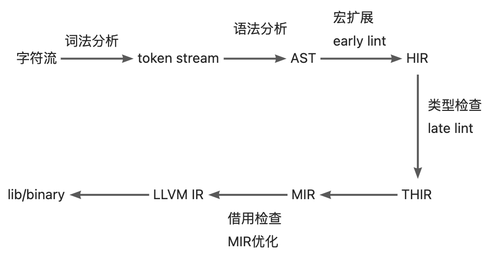
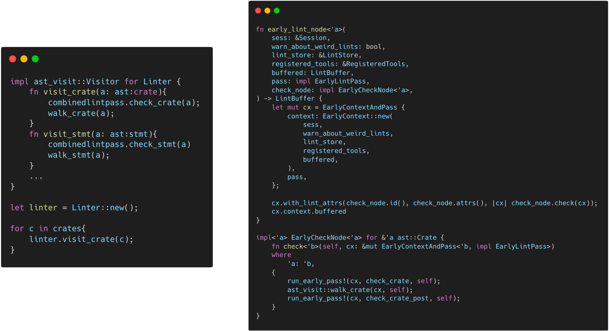

# Lint

## 背景

### Lint 工具

Lint 是代码静态分析工具的一种，最早是来源于 C 语言。Lint 工具通常会检查代码中潜在的问题和错误，包括（但不限于）编程风格（缩进、空行、空格）、代码质量（定义未使用的变量、文档缺失）以及错误代码（除0错误、重复定义、循环引用）等问题。通常来说，Lint 工具除了标识错误外，还会带有一定的 fix/refactor suggest 和 auto-fix 的能力。在工程中引入 Lint 工具可以有效的减少错误，提高整体的工程质量。此外，对一种编程语言来说，Lint 工具通常也是其他工具研发的前置条件，例如 IDE 插件的错误提示，CI 的 Pipeline 检测等。

## Lint 与 LintPass

### 概念与关系

Rustc 中关于 Lint 最主要的结构有两个， `Lint` 和 `LintPass`。首先需要区分 Lint 和 LintPass 的概念。Rustc 的很多文档中都将它们统称为 `Lint`，这很容易造成混淆。关于这两者之间的区别，rustc-dev-guide 给出的解释是：

> Lint declarations don't carry any "state" - they are merely global identifiers and descriptions of lints. We assert at runtime that they are not registered twice (by lint name).
Lint passes are the meat of any lint.

从定义方面， `Lint` 是对所定义的 lint 检查的静态描述，例如 name, level, description, code 等属性，与检查时的状态无关，Rustc 用 `Lint` 的定义做唯一性的检查。而 `LintPass` 是 `Lint` 的具体实现，是在检查时调用的 `check_*` 方法。
在具体的代码实现方法， `Lint`定义为一个 Struct，所有 lint 的定义都是此类型的一个实例/对象。而 `LintPass` 则对应为一个 trait。trait 类似于 java/c++ 中的接口，每一个 lintpass 的定义都需要实现该接口中定义的方法。

```rust
/// Specification of a single lint.
#[derive(Copy, Clone, Debug)]
pub struct Lint {
    pub name: &'static str,
    /// Default level for the lint.
    pub default_level: Level,
    /// Description of the lint or the issue it detects.
    ///
    /// e.g., "imports that are never used"
    pub desc: &'static str,
    ...
}

pub trait LintPass {
    fn name(&self) -> &'static str;
}
```

需要注意的是，尽管刚刚的描述中说到`trait` 类似于接口而 `Lint` 是一个 struct，但 `Lint` 和 `LintPass` 之间并不是 OO 中一个“类”和它的“方法”的关系。而是在声明 `LintPass` 会生成一个实现了该 trait 的同名的 struct，该 struct 中的 `get_lints()` 方法会生成对应的 `Lint` 定义。


这与 rustc-dev-guide 的描述也保持了一致:

> A lint might not have any lint pass that emits it, it could have many, or just one -- the compiler doesn't track whether a pass is in any way associated with a particular lint, and frequently lints are emitted as part of other work (e.g., type checking, etc.).

### Lint 与 LintPass 的宏定义

Rustc 为 Lint 和 LintPass 都提供了用于定义其结构的宏。
定义 Lint 的宏`declare_lint` 比较简单，可以在`rustc_lint_defs::lib.rs`中找到。`declare_lint` 宏解析输入参数，并生成名称为 `$NAME` 的 Lint struct。

```rust
#[macro_export]
macro_rules! declare_lint {
    ($(#[$attr:meta])* $vis: vis $NAME: ident, $Level: ident, $desc: expr) => (
        $crate::declare_lint!(
            $(#[$attr])* $vis $NAME, $Level, $desc,
        );
    );
    ($(#[$attr:meta])* $vis: vis $NAME: ident, $Level: ident, $desc: expr,
     $(@feature_gate = $gate:expr;)?
     $(@future_incompatible = FutureIncompatibleInfo { $($field:ident : $val:expr),* $(,)*  }; )?
     $($v:ident),*) => (
        $(#[$attr])*
        $vis static $NAME: &$crate::Lint = &$crate::Lint {
            name: stringify!($NAME),
            default_level: $crate::$Level,
            desc: $desc,
            edition_lint_opts: None,
            is_plugin: false,
            $($v: true,)*
            $(feature_gate: Some($gate),)*
            $(future_incompatible: Some($crate::FutureIncompatibleInfo {
                $($field: $val,)*
                ..$crate::FutureIncompatibleInfo::default_fields_for_macro()
            }),)*
            ..$crate::Lint::default_fields_for_macro()
        };
    );
    ($(#[$attr:meta])* $vis: vis $NAME: ident, $Level: ident, $desc: expr,
     $lint_edition: expr => $edition_level: ident
    ) => (
        $(#[$attr])*
        $vis static $NAME: &$crate::Lint = &$crate::Lint {
            name: stringify!($NAME),
            default_level: $crate::$Level,
            desc: $desc,
            edition_lint_opts: Some(($lint_edition, $crate::Level::$edition_level)),
            report_in_external_macro: false,
            is_plugin: false,
        };
    );
}
```

LintPass 的定义涉及到两个宏：

- declare_lint_pass：生成一个名为`$name` 的 struct，并且调用 `impl_lint_pass` 宏。

```rust
macro_rules! declare_lint_pass {
    ($(#[$m:meta])* $name:ident => [$($lint:expr),* $(,)?]) => {
        $(#[$m])* #[derive(Copy, Clone)] pub struct $name;
        $crate::impl_lint_pass!($name => [$($lint),*]);
    };
}
```

- impl_lint_pass：为生成的 `LintPass` 结构实现`fn name()`和 `fn get_lints()` 方法。

```rust
macro_rules! impl_lint_pass {
    ($ty:ty => [$($lint:expr),* $(,)?]) => {
        impl $crate::LintPass for $ty {
            fn name(&self) -> &'static str { stringify!($ty) }
        }
        impl $ty {
            pub fn get_lints() -> $crate::LintArray { $crate::lint_array!($($lint),*) }
        }
    };
}
```

### EarlyLintPass 与 LateLintPass

前面关于 `LintPass` 的宏之中，只定义了`fn name()`和 `fn get_lints()` 方法，但并没有定义用于检查的 `check_*` 函数。这是因为 Rustc 中将 `LintPass` 分为了更为具体的两类：`EarlyLintPass`和`LateLintPass`。其主要区别在于检查的元素是否带有类型信息，即在类型检查之前还是之后执行。例如， `WhileTrue` 检查代码中的 `while true{...}` 并提示用户使用 `loop{...}` 去代替。这项检查不需要任何的类型信息，因此被定义为一个  `EarlyLint`(代码中 `impl EarlyLintPass for WhileTrue`。

```rust
declare_lint! {
    WHILE_TRUE,
    Warn,
    "suggest using `loop { }` instead of `while true { }`"
}

declare_lint_pass!(WhileTrue => [WHILE_TRUE]);

impl EarlyLintPass for WhileTrue {
    fn check_expr(&mut self, cx: &EarlyContext<'_>, e: &ast::Expr) {
        ...
    }
}
```

Rustc 中用了3个宏去定义 `EarlyLintPass`：

- early_lint_methods：early_lint_methods 中定义了 `EarlyLintPass` 中需要实现的 `check_*`函数，并且将这些函数以及接收的参数 `$args`传递给下一个宏。

```rust
macro_rules! early_lint_methods {
    ($macro:path, $args:tt) => (
        $macro!($args, [
            fn check_param(a: &ast::Param);
            fn check_ident(a: &ast::Ident);
            fn check_crate(a: &ast::Crate);
            fn check_crate_post(a: &ast::Crate);
            ...
        ]);
    )
}
```

- declare_early_lint_pass：生成trait `EarlyLintPass` 并调用宏 `expand_early_lint_pass_methods`。

```rust
macro_rules! declare_early_lint_pass {
    ([], [$($methods:tt)*]) => (
        pub trait EarlyLintPass: LintPass {
            expand_early_lint_pass_methods!(&EarlyContext<'_>, [$($methods)*]);
        }
    )
}
```

- expand_early_lint_pass_methods：为`check_*`方法提供默认实现，即空检查。

```rust
macro_rules! expand_early_lint_pass_methods {
    ($context:ty, [$($(#[$attr:meta])* fn $name:ident($($param:ident: $arg:ty),*);)*]) => (
        $(#[inline(always)] fn $name(&mut self, _: $context, $(_: $arg),*) {})*
    )
}
```

这样的设计好处有以下几点：

1. 因为 LintPass 是一个 trait，每一个 LintPass 的定义都需要实现其内部定义的所有方法。但 early lint 和 late lint 发生在编译的不同阶段，函数入参也不一致（AST 和 HIR）。因此，LintPass 的定义只包含了 `fn name()` 和 `fn get_lints()` 这两个通用的方法。而执行检查函数则定义在了更为具体的 `EarlyLintPass` 和 `LateLintPass` 中。
1. 同样的，对于 `EarlyLintPass`， 每一个 lintpass 的定义都必须实现其中的所有方法。但并非每一个 lintpass 都需要检查 AST 的所有节点。 `expand_early_lint_pass_methods` 为其内部方法提供了默认实现。这样在定义具体的 lintpass 时，只需要关注和实现其相关的检查函数即可。例如，对于 `WhileTrue` 的定义，因为 `while true { }`这样的写法只会出现在 `ast::Expr` 节点中，因此只需要实现 `check_expr` 函数即可。在其他任何节点调用 `WhileTrue` 的检查函数，如在检查 AST 上的标识符节点时，调用 `WhileTrue.check_ident()`，则根据宏 `expand_early_lint_pass_methods` 中的定义执行一个空函数。

### pass 的含义

在 Rustc 中，除了 `Lint` 和 `LintPass` 外，还有一些 `*Pass` 的命名，如 `Mir` 和 `MirPass`、`rustc_passes` 包等。编译原理龙书中对Pass有对应的解释：

> 1.2.8 将多个步骤组合成趟
前面关于步骤的讨论讲的是一个编译器的逻辑组织方式。在一个特定的实现中，多个步骤的活动可以被组合成一趟（pass）。每趟读入一个输入文件并产生一个输出文件。

在声明 `LintPass` 的宏 `declare_lint_pass` 中，其第二个参数为一个列表，表示一个 lintpass 可以生成多个 lint。Rustc 中还有一些 CombinedLintPass 中也是将所有 builtin 的 lint 汇总到一个 lintpass 中。这与龙书中“趟”的定义基本一致:`LintPass` 可以组合多个 `Lint` 的检查，每个 LintPass 读取一个 AST 并产生对应的结果。

## Lint 的简单实现

在 LintPass 的定义中，给每一个 lintpass 的所有 `check_*` 方法都提供了一个默认实现。到这里为止，基本上已经可以实现 Lint 检查的功能。

```rust
struct Linter { }
impl ast_visit::Visitor for Linter {
    fn visit_crate(a: ast:crate){
        for lintpass in lintpasses{
            lintpass.check_crate(a)
        }
        walk_crate();
    }
    fn visit_stmt(a: ast:stmt){
        for lintpass in lintpasses{
            lintpass.check_stmt(a)
        }
        walk_stmt();
    }
    ...
}

let linter = Linter::new();

for c in crates{
    linter.visit_crate(c);
}
```

`Visitor` 是遍历 AST 的工具，在这里为 Linter 实现其中的 `visit_*` 方法，在遍历时调用所有 lintpass 的 `check_*` 函数。`walk_*` 会继续调用其他的 `visit_*` 函数，遍历其中的子节点。因此，对于每一个 crate， 只需要调用 `visit_crate()` 函数就可以遍历 AST 并完成检查。

## CombinedLintpass

但是，Rustc 自身和 clippy 提供的 Lint 定义多达550+多个。考虑到性能因素，定义大量的 LintPass，分别注册和调用显然是不合适的。Rustc 提供了一种更优的解决方法：既然可以将多个 Lint 组织为一个 LintPass，同样也可以将多个 LintPass 组合成一个 CombinedLintPass。
> [Compiler lint passes are combined into one pass](https://rustc-dev-guide.rust-lang.org/diagnostics/lintstore.html#compiler-lint-passes-are-combined-into-one-pass)
> Within the compiler, for performance reasons, we usually do not register dozens of lint passes. Instead, we have a single lint pass of each variety (e.g., BuiltinCombinedModuleLateLintPass) which will internally call all of the individual lint passes; this is because then we get the benefits of static over dynamic dispatch for each of the (often empty) trait methods.
> Ideally, we'd not have to do this, since it adds to the complexity of understanding the code. However, with the current type-erased lint store approach, it is beneficial to do so for performance reasons.

### BuiltinCombinedEarlyLintPass

CombinedLintPass 同样分为 early 和 late 两类。 以 builtin 的 early lint 为例，Rustc 在 `rustc_lint::src::lib.rs` 中为这些 lintpass 定义了一个 `BuiltinCombinedEarlyLintPass` 结构。

```rust
early_lint_passes!(declare_combined_early_pass, [BuiltinCombinedEarlyLintPass]);
```

虽然这个定义看起来只有一行，但其中通过若干个宏的展开，汇总了14个 `LintPass`，并且每个 `LintPass` 提供了50多个 `check_*` 方法。接下来一一说明这些宏。

#### BuiltinCombinedEarlyLintPass 的宏定义

##### early_lint_passes

```rust
macro_rules! early_lint_passes {
    ($macro:path, $args:tt) => {
        $macro!(
            $args,
            [
                UnusedParens: UnusedParens,
                UnusedBraces: UnusedBraces,
                UnusedImportBraces: UnusedImportBraces,
                UnsafeCode: UnsafeCode,
                AnonymousParameters: AnonymousParameters,
                EllipsisInclusiveRangePatterns: EllipsisInclusiveRangePatterns::default(),
                NonCamelCaseTypes: NonCamelCaseTypes,
                DeprecatedAttr: DeprecatedAttr::new(),
                WhileTrue: WhileTrue,
                NonAsciiIdents: NonAsciiIdents,
                HiddenUnicodeCodepoints: HiddenUnicodeCodepoints,
                IncompleteFeatures: IncompleteFeatures,
                RedundantSemicolons: RedundantSemicolons,
                UnusedDocComment: UnusedDocComment,
            ]
        );
    };
}
```

首先是 early_lint_passes 宏，这个宏的主要作用是定义了所有的 early lintpass。这里的 lintpass 是成对出现的，`:`左边为 lintpass 的 Identifier，`:`右边为 lintpass 的constructor。所以会出现 `EllipsisInclusiveRangePatterns::default()` 和 `DeprecatedAttr::new()`这种形式。early_lint_passes 会将定义的 early lintpass 和 第二个参数一起传递给下一个宏。
通过这个宏，之前的`BuiltinCombinedEarlyLintPass`的定义被展开为：

```rust
declare_combined_early_pass!([BuiltinCombinedEarlyLintPass], [
                UnusedParens: UnusedParens,
                UnusedBraces: UnusedBraces,
                UnusedImportBraces: UnusedImportBraces,
                UnsafeCode: UnsafeCode,
                AnonymousParameters: AnonymousParameters,
                EllipsisInclusiveRangePatterns: EllipsisInclusiveRangePatterns::default(),
                NonCamelCaseTypes: NonCamelCaseTypes,
                DeprecatedAttr: DeprecatedAttr::new(),
                WhileTrue: WhileTrue,
                NonAsciiIdents: NonAsciiIdents,
                HiddenUnicodeCodepoints: HiddenUnicodeCodepoints,
                IncompleteFeatures: IncompleteFeatures,
                RedundantSemicolons: RedundantSemicolons,
                UnusedDocComment: UnusedDocComment,
            ])
```

##### declare_combined_early_pass

```rust
macro_rules! declare_combined_early_pass {
    ([$name:ident], $passes:tt) => (
        early_lint_methods!(declare_combined_early_lint_pass, [pub $name, $passes]);
    )
}
```

declare_combined_early_pass 宏接收 early_lint_passes宏传来的 name(BuiltinCombinedEarlyLintPass) 和 passes，并继续传递给 early_lint_methods 宏。
通过这个宏，`BuiltinCombinedEarlyLintPass`的定义继续展开为：

```rust
early_lint_methods!(declare_combined_early_lint_pass, 
                    [pub BuiltinCombinedEarlyLintPass, 
                      [
                            UnusedParens: UnusedParens,
                            UnusedBraces: UnusedBraces,
                            UnusedImportBraces: UnusedImportBraces,
                            UnsafeCode: UnsafeCode,
                            AnonymousParameters: AnonymousParameters,
                            EllipsisInclusiveRangePatterns: EllipsisInclusiveRangePatterns::default(),
                            NonCamelCaseTypes: NonCamelCaseTypes,
                            DeprecatedAttr: DeprecatedAttr::new(),
                            WhileTrue: WhileTrue,
                            NonAsciiIdents: NonAsciiIdents,
                            HiddenUnicodeCodepoints: HiddenUnicodeCodepoints,
                            IncompleteFeatures: IncompleteFeatures,
                            RedundantSemicolons: RedundantSemicolons,
                            UnusedDocComment: UnusedDocComment,
               ]
                    ]);
```

##### early_lint_methods

```rust
macro_rules! early_lint_methods {
    ($macro:path, $args:tt) => (
        $macro!($args, [
            fn check_param(a: &ast::Param);
            fn check_ident(a: &ast::Ident);
            fn check_crate(a: &ast::Crate);
            fn check_crate_post(a: &ast::Crate);
            ...
        ]);
    )
}
```

early_lint_methods 宏在前一篇文章中也介绍过，它定义了 `EarlyLintPass` 中需要实现的 `check_*`函数，并且将这些函数以及接收的参数 `$args`传递给下一个宏。因为 `BuiltinCombinedEarlyLintPass` 也是 early lint 的一种，所以同样需要实现这些函数。
通过这个宏，`BuiltinCombinedEarlyLintPass`的定义继续展开为：

```rust
declare_combined_early_lint_pass!(
    [pub BuiltinCombinedEarlyLintPass, 
        [
            UnusedParens: UnusedParens,
            UnusedBraces: UnusedBraces,
            UnusedImportBraces: UnusedImportBraces,
            UnsafeCode: UnsafeCode,
            AnonymousParameters: AnonymousParameters,
            EllipsisInclusiveRangePatterns: EllipsisInclusiveRangePatterns::default(),
            NonCamelCaseTypes: NonCamelCaseTypes,
            DeprecatedAttr: DeprecatedAttr::new(),
            WhileTrue: WhileTrue,
            NonAsciiIdents: NonAsciiIdents,
            HiddenUnicodeCodepoints: HiddenUnicodeCodepoints,
            IncompleteFeatures: IncompleteFeatures,
            RedundantSemicolons: RedundantSemicolons,
            UnusedDocComment: UnusedDocComment,
        ]
    ],
    [
        fn check_param(a: &ast::Param);
        fn check_ident(a: &ast::Ident);
        fn check_crate(a: &ast::Crate);
        fn check_crate_post(a: &ast::Crate);
        ...
    ]
)
```

##### declare_combined_early_lint_pass

```rust
macro_rules! declare_combined_early_lint_pass {
    ([$v:vis $name:ident, [$($passes:ident: $constructor:expr,)*]], $methods:tt) => (
        #[allow(non_snake_case)]
        $v struct $name {
            $($passes: $passes,)*
        }
        impl $name {
            $v fn new() -> Self {
                Self {
                    $($passes: $constructor,)*
                }
            }
            $v fn get_lints() -> LintArray {
                let mut lints = Vec::new();
                $(lints.extend_from_slice(&$passes::get_lints());)*
                lints
            }
        }
        impl EarlyLintPass for $name {
            expand_combined_early_lint_pass_methods!([$($passes),*], $methods);
        }
        #[allow(rustc::lint_pass_impl_without_macro)]
        impl LintPass for $name {
            fn name(&self) -> &'static str {
                panic!()
            }
        }
    )
}
```

declare_combined_early_lint_pass宏是生成 `BuiltinCombinedEarlyLintPass` 的主体。这个宏中做了以下工作：

- 生成一个名为 `BuiltinCombinedEarlyLintPass` 的 struct，其中的属性为宏 `early_lint_passes` 提供的 lintpass 的 identifier。
- 实现 `fn new()` `fn name()` 和 `fn get_lints()` 方法。其中 `new()` 调用了 `early_lint_passes` 提供的 lintpass 的 constructor。
- 调用宏 `expand_combined_early_lint_pass_methods`，实现自身的 `check_*` 方法。

通过这个宏，`BuiltinCombinedEarlyLintPass`的定义变为：

```rust
pub struct BuiltinCombinedEarlyLintPass {
            UnusedParens: UnusedParens,
            UnusedBraces: UnusedBraces,
            UnusedImportBraces: UnusedImportBraces,
            UnsafeCode: UnsafeCode,
            AnonymousParameters: AnonymousParameters,
            EllipsisInclusiveRangePatterns: EllipsisInclusiveRangePatterns,
            NonCamelCaseTypes: NonCamelCaseTypes,
            DeprecatedAttr: DeprecatedAttr,
            WhileTrue: WhileTrue,
            NonAsciiIdents: NonAsciiIdents,
            HiddenUnicodeCodepoints: HiddenUnicodeCodepoints,
            IncompleteFeatures: IncompleteFeatures,
            RedundantSemicolons: RedundantSemicolons,
            UnusedDocComment: UnusedDocComment,
}
impl BuiltinCombinedEarlyLintPass {
    pub fn new() -> Self {
        Self {
            UnusedParens: UnusedParens,
            UnusedBraces: UnusedBraces,
            UnusedImportBraces: UnusedImportBraces,
            UnsafeCode: UnsafeCode,
            AnonymousParameters: AnonymousParameters,
            EllipsisInclusiveRangePatterns: EllipsisInclusiveRangePatterns::default(),
            NonCamelCaseTypes: NonCamelCaseTypes,
            DeprecatedAttr: DeprecatedAttr::new(),
            WhileTrue: WhileTrue,
            NonAsciiIdents: NonAsciiIdents,
            HiddenUnicodeCodepoints: HiddenUnicodeCodepoints,
            IncompleteFeatures: IncompleteFeatures,
            RedundantSemicolons: RedundantSemicolons,
            UnusedDocComment: UnusedDocComment,
        }
    }
    pub fn get_lints() -> LintArray {
        let mut lints = Vec::new();
        lints.extend_from_slice(&UnusedParens::get_lints());
        lints.extend_from_slice(&UnusedBraces::get_lints());
        lints.extend_from_slice(&UnusedImportBraces::get_lints());
        lints.extend_from_slice(&UnsafeCode::get_lints());
        lints.extend_from_slice(&AnonymousParameters::get_lints());
        lints.extend_from_slice(&EllipsisInclusiveRangePatterns::get_lints());
        lints.extend_from_slice(&NonCamelCaseTypes::get_lints());
        lints.extend_from_slice(&DeprecatedAttr::get_lints());
        lints.extend_from_slice(&WhileTrue::get_lints());
        lints.extend_from_slice(&NonAsciiIdents::get_lints());
        lints.extend_from_slice(&HiddenUnicodeCodepoints::get_lints());
        lints.extend_from_slice(&IncompleteFeatures::get_lints());
        lints.extend_from_slice(&RedundantSemicolons::get_lints());
        lints.extend_from_slice(&UnusedDocComment::get_lints());
        
        lints
    }
}
impl EarlyLintPass for BuiltinCombinedEarlyLintPass {
    expand_combined_early_lint_pass_methods!([$($passes),*], $methods);
}
#[allow(rustc::lint_pass_impl_without_macro)]
impl LintPass for BuiltinCombinedEarlyLintPass {
    fn name(&self) -> &'static str {
        panic!()
    }
}
```

##### expand_combined_early_lint_pass_methods

```rust
macro_rules! expand_combined_early_lint_pass_methods {
    ($passes:tt, [$($(#[$attr:meta])* fn $name:ident($($param:ident: $arg:ty),*);)*]) => (
        $(fn $name(&mut self, context: &EarlyContext<'_>, $($param: $arg),*) {
            expand_combined_early_lint_pass_method!($passes, self, $name, (context, $($param),*));
        })*
    )
}
```

expand_combined_early_lint_pass_methods宏在 `BuiltinCombinedEarlyLintPass` 中展开所有 `early_lint_methods` 中定义的方法。
通过这个宏，`BuiltinCombinedEarlyLintPass`的定义变为（省略其他定义）：

```rust
impl EarlyLintPass for BuiltinCombinedEarlyLintPass {
    fn check_param(&mut self, context: &EarlyContext<'_>, a: &ast::Param) {
        expand_combined_early_lint_pass_method!($passes, self, $name, (context, $($param),*));
    }
    fn check_ident(&mut self, context: &EarlyContext<'_>, a: &ast::Ident) {
        expand_combined_early_lint_pass_method!($passes, self, $name, (context, $($param),*));
    }
    fn check_crate(&mut self, context: &EarlyContext<'_>, a: &ast::Crate) {
        expand_combined_early_lint_pass_method!($passes, self, $name, (context, $($param),*));
    }
    ...
    
}
```

##### expand_combined_early_lint_pass_method

```rust
macro_rules! expand_combined_early_lint_pass_method {
    ([$($passes:ident),*], $self: ident, $name: ident, $params:tt) => ({
        $($self.$passes.$name $params;)*
    })
}
```

expand_combined_early_lint_pass_method：在展开的`check_*` 函数中调用每一个 `LintPass` 的 `check_*`。
通过这个宏，`BuiltinCombinedEarlyLintPass`的定义变为（省略其他定义）：

```rust
impl EarlyLintPass for BuiltinCombinedEarlyLintPass {
    fn check_param(&mut self, context: &EarlyContext<'_>, a: &ast::Param) {
        self.UnusedParens.check_param(context, a);
        self.UnusedBraces.check_param(context, a);
        self.UnusedImportBraces.check_param(context, a);
        ...
    }
    fn check_ident(&mut self, context: &EarlyContext<'_>, a: &ast::Ident) {
        self.UnusedParens.check_ident(context, a);
        self.UnusedBraces.check_ident(context, a);
        self.UnusedImportBraces.check_ident(context, a);
        ...
    }
    fn check_crate(&mut self, context: &EarlyContext<'_>, a: &ast::Crate) {
        self.UnusedParens.check_crate(context, a);
        self.UnusedBraces.check_crate(context, a);
        self.UnusedImportBraces.check_crate(context, a);
        ...
    }
    ...
    
}
```

#### BuiltinCombinedEarlyLintPass 的最终定义

通过以上宏的展开，`BuiltinCombinedEarlyLintPass`的定义实际为如下形式：

```rust
pub struct BuiltinCombinedEarlyLintPass {
    UnusedParens: UnusedParens,
    UnusedBraces: UnusedBraces,
    ...
}

impl BuiltinCombinedEarlyLintPass{
    pub fn new() -> Self {
        UnusedParens: UnusedParens,
        UnusedBraces: UnusedBraces,
        ...
    }
    
    pub fn get_lints() -> LintArray {
        let mut lints = Vec::new();
        lints.extend_from_slice(&UnusedParens::get_lints());
        lints.extend_from_slice(&UnusedBraces::get_lints());
        ...
        lints
    }
}

impl EarlyLintPass for BuiltinCombinedEarlyLintPass {
    fn check_crates(&mut self, context: &EarlyContext<'_>, a: &ast::Crate){
        self.UnusedParens.check_crates (context, a);
        self.UnusedBraces.check_crates (context, a);
        ...
    }
    fn check_ident(&mut self, context: &EarlyContext<'_>, a: Ident){
        self.UnusedParens.check_ident (context, a);
        self.UnusedBraces.check_ident (context, a);
        ...
    }
    .. 
}
```

通过这个定义，可以在遍历 AST 时使用 `BuiltinCombinedEarlyLintPass` 的 `check_*` 方法实现多个 lintpass 的检查。

## Lint 的进一步优化

基于 CombinedLintPass ，可以对之前提出的 Linter 的设计做进一步优化。


这里，可以用 CombinedLintPass 的`check_*` 方法，在 Visitor 遍历 AST 时执行对应的检查。虽然效果与之前一致，但因为宏的关系，所有的 `check_*` 方法和需要执行的 lintpass 都被收集到了一个结构中，也更容易管理。同样的，因为 CombinedLintPass 实际上调用的是每个 lintpass 各自的 check 方法，虽然调用起来可能下图一样很复杂，但因为 lintpass 中定义的 check 方法大部分是由宏生成的空检查，所以也不会造成性能上的损失。


## Lint 的执行流程

## Rustc 中 Lint 的执行阶段

Rustc 的设计与经典编译器的设计基本无异，包含词法分析、语法分析、语义分析、生成IR、IR优化和代码生成等流程，但针对 Rust 的语言特性，还加入了一些特有的流程，如借用检查。对应的，代码在整个编译流程中的中间表示也有一定的扩展：

- Token stream：Lexer 将源代码的字符流转化为词法单元（token） 流，这些词法单元被传递给下一个步骤，即语法分析。
- Abstract Syntax Tree(AST)：Parser 将 Token 流转换为抽象语法树（AST），抽象语法树几乎可以完全描述源代码中所写的内容。在 AST 上，Rustc 还执行了宏扩展、 early lint 等过程。
- High-level IR(HIR)：这是一种脱糖的 AST。它仍与源代码中的内容非常接近，但它包含一些隐含的东西，例如一些省略的生命周期等。这个 IR 适合类型检查。late lint也在类型检查之后进行。
- Typed HIR(THIR)：THIR 与 HIR 类似，但它携带了类型信息，并且更加脱糖（例如，函数调用和隐式的间接引用都会变成完全显式）。
- Middle-level IR(MIR)：MIR 基本上是一个控制流图（Control-Flow Graph）。CFG 是程序执行过程的抽象表现，代表了程序执行过程中会遍历到的所有路径。它用图的形式表示一个过程内所有基本块可能流向。Rustc 在 MIR 上除了基础的基于 CFG 的静态分析和 IR 优化外，还进行了 Rust 中所有权的借用检查。
- LLVM IR：Rustc 的后端采用了 LLVM，因此，Rustc 会将 MIR 进一步转化为 LLVM IR 并传递给 LLVM 做进一步优化和代码生成的工作。

以上 Rust 代码的中间表示的转化流程也反映了 Rust 整个编译的流程，总结为一张图：

Rustc 中的 `rustc_driver::lib.rs` 中控制了编译流程的各个阶段：

```bash
fn run_compiler(...) -> interface::Result<()> {
    ...
    interface::run_compiler(config, |compiler| {
        let linker = compiler.enter(|queries| {
            ...
            queries.parse()?;   // lexer parse
            ...
            queries.expansion()?; // resolver
            ...
            queries.prepare_outputs()?;
            ...
            queries.global_ctxt()?; // ast -> hir
            ...
            queries.ongoing_codegen()?;
            ...
            }
}
```

前面介绍过，Rustc 中的 Lint 包含 early 和 late 两种，它们分别在 AST -> HIR 和 HIR -> THIR 两个阶段执行。这里我们同样以 `WhileTrue` 这个例子去看 Lint 从定义、到注册，最后执行的完整的流程。同时，`WhileTrue` 是 builtin 的 early lint 其中的一种，被包含在 `BuiltinCombinedEarlyLintPass` 之中。

### 定义

首先是 `WhileTrue`的 lint 和对应的 lintpass 的定义，它们被定义在  `rustc_lint/src/builtin.rs` 中

```rust
declare_lint! {
    /// The `while_true` lint detects `while true { }`.
    ///
    /// ### Example
    ///
    /// ```rust,no_run
    /// while true {
    ///
    /// }
    /// ```
    ///
    /// {{produces}}
    ///
    /// ### Explanation
    ///
    /// `while true` should be replaced with `loop`. A `loop` expression is
    /// the preferred way to write an infinite loop because it more directly
    /// expresses the intent of the loop.
    WHILE_TRUE,
    Warn,
    "suggest using `loop { }` instead of `while true { }`"
}

declare_lint_pass!(WhileTrue => [WHILE_TRUE]);

impl EarlyLintPass for WhileTrue {
    fn check_expr(&mut self, cx: &EarlyContext<'_>, e: &ast::Expr) {
      ...
    }
}
```

与前面的介绍一样：

1. `declare_lint` 宏声明一个 lint：`WHILE_TRUE`
2. `declare_lint_pass` 宏声明一个lintpass：`WhileTrue`
3. 为 `WhileTrue` 实现 `EarlyLintPass` 中对应的检查方法，因为此 lintpass 只检查 Expr 节点，所以只需要实现 `check_expr()`函数即可。

### 注册

注册是指编译过程中将 Lint 加入到 LintStore 的过程。`WhileTrue` 不需要单独的注册和执行，它的检查方法通过宏扩展的方式展开到 `BuiltinCombinedEarlyLintPass` 中。`BuiltinCombinedEarlyLintPass` 的注册和执行都发生在 `queries.expansion()` 函数中。

```rust
pub fn expansion(
    &self,
) -> Result<&Query<(Rc<ast::Crate>, Rc<RefCell<BoxedResolver>>, Lrc<LintStore>)>> {
    tracing::trace!("expansion");
    self.expansion.compute(|| {
        let crate_name = self.crate_name()?.peek().clone();
        // 注册
        let (krate, lint_store) = self.register_plugins()?.take(); 
        let _timer = self.session().timer("configure_and_expand");
        let sess = self.session();
        let mut resolver = passes::create_resolver(
            sess.clone(),
            self.codegen_backend().metadata_loader(),
            &krate,
            &crate_name,
        );
        let krate = resolver.access(|resolver| {
            // 执行
            passes::configure_and_expand(sess, &lint_store, krate, &crate_name, resolver)
        })?;
        Ok((Rc::new(krate), Rc::new(RefCell::new(resolver)), lint_store))
    })
}
```

注册的过程会生成定义的 lint 的结构并添加到 [LintStore](https://rustc-dev-guide.rust-lang.org/diagnostics/lintstore.html) 中。Lint 整体上被分为4个种类：pre-expansion, early, late,  late-module。尽管 Lint 对应的 LintPass 在编译流程中执行的阶段不同，但注册都是发生在同一个阶段。
Lint 注册过程的函数调用链路如下：

- rustc_driver::lib::run_compiler()
- rustc_interface::queries::Queries.expansion()
- rustc_interface::queries::Queries.register_plugins()
- rustc_lint::lib::new_lint_store()
- rustc_lint::lib::register_builtins()

在这里，默认的编译流程会执行 else{} 分支中的语句，BuiltinCombinedEarlyLintPass::get_lints() 会生成 `WHILE_TRUE` 并添加到 LintStore中。

```rust
if no_interleave_lints {
    pre_expansion_lint_passes!(register_passes, register_pre_expansion_pass);
    early_lint_passes!(register_passes, register_early_pass);
    late_lint_passes!(register_passes, register_late_pass);
    late_lint_mod_passes!(register_passes, register_late_mod_pass);
} else {
    store.register_lints(&BuiltinCombinedPreExpansionLintPass::get_lints());
    store.register_lints(&BuiltinCombinedEarlyLintPass::get_lints());
    store.register_lints(&BuiltinCombinedModuleLateLintPass::get_lints());
    store.register_lints(&BuiltinCombinedLateLintPass::get_lints());
}
```

### 执行

不同的 LintPass 的执行过程发生在编译过程的不同阶段，其中，`BuiltinCombinedEarlyLintPass` 执行过程的函数调用链路如下：

- rustc_driver::lib::run_compiler()
- rustc_interface::queries::Queries.expansion()
- rustc_interface::passes::configure_and_expand()
- rustc_lint::early::check_ast_node()
- rustc_lint::early::early_lint_node()

首先，在 configure_and_expand() 函数中，执行了 pre-expansion 和 early 两种 lintpass。注册时使用了 BuiltinCombinedEarlyLintPass::get_lints() 方法生成 lints，而这里用 BuiltinCombinedEarlyLintPass::new() 方法生成了 lintpass。

```rust
pub fn configure_and_expand(
    sess: &Session,
    lint_store: &LintStore,
    mut krate: ast::Crate,
    crate_name: &str,
    resolver: &mut Resolver<'_>,
) -> Result<ast::Crate> {
    pre_expansion_lint(sess, lint_store, resolver.registered_tools(), &krate, crate_name);
    ...
    sess.time("early_lint_checks", || {
        let lint_buffer = Some(std::mem::take(resolver.lint_buffer()));
        rustc_lint::check_ast_node(
            sess,
            false,
            lint_store,
            resolver.registered_tools(),
            lint_buffer,
            rustc_lint::BuiltinCombinedEarlyLintPass::new(),
            &krate,
        )
    });
}
```

Lint 的执行最终发生在 `rustc_lint::early::early_lint_node()` 函数中。比较 `early_lint_node()` 函数和 `CombinedLintPass` 一节最后的伪代码：



它们之间有以下的对应关系：

- 参数 pass 是 configure_and_expand() 函数中新建的 BuiltinCombinedEarlyLintPass，它对应 combinedlintpass。
- EarlyContextAndPass 将  pass 与 context 信息组合在一起，并且实现了 visitor，它对应 Linter。
- check_node.check(cx) 调用了 cx.pass.check_crate() 进行 lint 检查，根据 BuiltinCombinedEarlyLintPass 的定义， 这个函数中会调用所有 builtin early lint 的 check_crate() 方法，然后执行 ast_visit::walk_crate() 遍历子节点，它对应了 visit_crate()。

## no_interleave_lints

虽然 Rustc 中考虑性能因素，将 LintPass 组合成 CombinedLintPass，但提供了一些编译参数去配置 Lint。其中，Lint 的注册和执行过程中都用到了 no_interleave_lints 参数。这个参数默认为 false，表示是否单独执行每一个 lint。编译时将这个修改这个参数就可以单独注册每一个 lint 以及单独执行 lintpass，这样的设计提供了更好的灵活性和自定义的能力（比如，可以对每一个 lint 单独做 benchmark）。

```rust
if no_interleave_lints {
    pre_expansion_lint_passes!(register_passes, register_pre_expansion_pass);
    early_lint_passes!(register_passes, register_early_pass);
    late_lint_passes!(register_passes, register_late_pass);
    late_lint_mod_passes!(register_passes, register_late_mod_pass);
} else {
    store.register_lints(&BuiltinCombinedPreExpansionLintPass::get_lints());
    store.register_lints(&BuiltinCombinedEarlyLintPass::get_lints());
    store.register_lints(&BuiltinCombinedModuleLateLintPass::get_lints());
    store.register_lints(&BuiltinCombinedLateLintPass::get_lints());
}
```

```rust
pub fn check_ast_node<'a>(...) {
    if sess.opts.debugging_opts.no_interleave_lints {
        for (i, pass) in passes.iter_mut().enumerate() {
            buffered =
                sess.prof.extra_verbose_generic_activity("run_lint", pass.name()).run(|| {
                    early_lint_node(
                        sess,
                        !pre_expansion && i == 0,
                        lint_store,
                        registered_tools,
                        buffered,
                        EarlyLintPassObjects { lints: slice::from_mut(pass) },
                        check_node,
                    )
                });
        }
    } else {
        buffered = early_lint_node(
            sess,
            !pre_expansion,
            lint_store,
            registered_tools,
            buffered,
            builtin_lints,
            check_node,
        );
        ...
    }
}
```

## 总结

至此，我们就分析了 Rustc 中一个 Lint 定义、实现对应的检查(LintPass)、注册、最终执行的完整流程。我们也可以利用这些宏，去定义新的Lint和LintPass(Clippy 中也是以相似的方式)。当然，Rustc 中关于 Lint 的部分远远不止这些，我只是分享了其中我能理解的一小部分，希望能够对大家有所帮助。

除此之外，我们在 [KCLVM](https://github.com/KusionStack/KCLVM) 这个项目中，也有对这部分内容的应用与实践，可以在这个 [Issue](https://github.com/KusionStack/KCLVM/issues/109) 和 [PR](https://github.com/KusionStack/KCLVM/pull/160) 看到更为详细的设计方案和具体实现，包含了visitor模式，lint、lintpass、combinedlintpass的定义，在resolver阶段调用lint检查等实现，欢迎批评指正。
